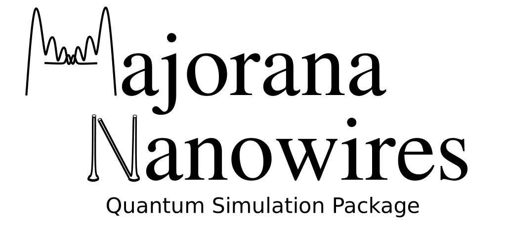

MajoranaNanowires is a numerical package for Python that allows to model and simulate Majorana nanowire devices an other related semiconductor/superconductor heterostructures. The simulations can include both, the description of the nanowire (or other structures) using tight-binding Hamiltonians, and the electrostatic interactions with the environment using finite element methods (Fenics).

(Social media)
(index)

key features

Examples

Benchmarks

Documentation

Installation

Credits
This software uses the following open source packages:
-Pfaffian
-Fenics

License

How to cite

List of publications

